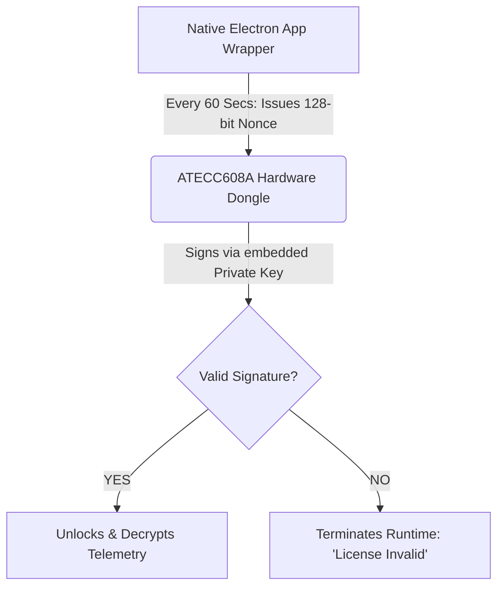

<<<<<<< HEAD
# PulseGrid OS – Complete Ecosystem

## Quick Start
1. Start backend: `cd backend && npm install && npx ts-node src/seed.ts && npm run dev`
2. Start frontend: `cd frontend && npm install --legacy-peer-deps && npm run dev`
3. Open http://localhost:3000/login

### Demo Credentials
| Role            | Username      | Password   |
|-----------------|---------------|------------|
| Admin           | admin         | admin123   |
| Emergency Doctor| emergency1    | er123      |
| Hospital Staff  | hospital1     | hs123      |
| Ambulance Driver| ambulance1    | am123      |
| Patient         | patient1      | pt123      |

## Features
- Tactical HUD with pulsing triage
- Rescue heartbeat animation
- Custom canvas map (offline)
- AI chatbot (Groq)
- Role-based access
- Hardware firmware included
=======

<div align="center">

# 🚀 PulseGrid OS ⚡
**Save Lives, Anywhere, Anytime.**

*The Air-Gapped Enterprise Operating System for the First 48 Hours of Global Crisis.*

[](#)
[](#)
[](#)
[](#)

</div>

---

## 💡 Executive Summary

PulseGrid OS is an **infrastructure-free, self-healing, two-way rescue ecosystem** designed to operate when cellular networks, power grids, internet connections, and GPS networks are completely dead.

### 💰 Ultra-Low Cost
* 📡 **Wearable Node (Field Unit):** ₹1,158 ($14)
* 🎛️ **Gateway Hub (Command Center):** ₹1,550 ($18)
* 🛑 **Total Base System:** **₹2,708 ($32)**

> ⏱️ **The Golden Hour Matrix**  
> PulseGrid cuts triage recovery windows from **over 6 hours down to under 2 hours.**
> * **0–5 min:** Immediate rescue (**90%** survival rate).
> * **5–60 min:** The Golden Hour (**50–90%** survival rate).
> * **>24 hours:** Minimal survival (**<5%** survival rate).

---

## ⚙️ System Architecture & Data Flow


```json
{
  "$schema": "[https://raw.githubusercontent.com/AgentMesh/ai-manifest/main/schema.json](https://raw.githubusercontent.com/AgentMesh/ai-manifest/main/schema.json)",
  "version": "1.0.0",
  "name": "PulseGrid OS",
  "description": "Ultra-low-cost, infrastructure-independent search and rescue tracking...",
  "tags": ["LoRa", "ESP32", "Next.js", "IoT", "Rescue", "Offline-First", "Air-Gapped"],
  "capabilities": [
    "Real-time vitals monitoring (HR + SpO2)",
    "Impact/fall detection with edge AI",
    "Automated triage matrix (Red/Yellow/Green/Black)",
    "AES-128 encrypted payloads"
  ]
}

```

### 📡 Network Protocol Stack

* **📱 Application:** Next.js 15 Dashboard (React) | WebSocket API (`ws://192.168.4.1:81`)
* **🔀 Transport:** Local Wi-Fi (Hub → Dashboard) | WebSocket | TCP/IP
* **🌐 Network:** LoRa (Node → Hub) | 433/865/868/915MHz | AES-128 Encryption
* **🔌 Physical:** SX1278 LoRa Transceiver | ESP32-C3 / ESP32-S3 | MAX30102 + MPU6050

```c
struct __attribute__((packed)) Packet {
  uint8_t id;          // Node ID (1-255)
  uint8_t hr;          // Heart Rate (0-255 BPM)
  uint8_t spo2;        // SpO2 (0-100%)
  uint8_t gForce;      // G-Force * 10 (e.g., 12 = 1.2G)
  uint8_t battery;     // Battery % (0-100)
  uint8_t flags;       // Bitmask: Emergency, Offline, Impact, Low-Batt
  uint32_t timestamp;  // Unix timestamp (4 bytes)
};

```

---

## 🛒 Complete Bill of Materials (BOM)

### 1️⃣ Wearable Node (Field Unit) — ₹1,158

| Component | Model | Qty | Notes |
| --- | --- | --- | --- |
| **Microcontroller** | ESP32-C3/WROOM (3.3V) | 1 | Brain of the node |
| **LoRa Module** | SX1278 (Ra-02) | 1 | Long-range radio module |
| **Vitals Sensor** | MAX30102 (I2C) | 1 | Heart Rate + SpO2 |
| **Accelerometer** | MPU6050 (I2C) | 1 | 6-axis G-Force + Impact tracking |
| **Battery** | 3.7V 2000mAh LiPo | 1 | Up to 24h lifecycle in idle |
| *Misc* | Antenna, OLED, Buzzer, LED | 1 ea | Interconnects & Local Status |

> ⚠️ **CRITICAL HARDWARE WARNINGS:**
> ⛔ **NEVER** power on the LoRa modules without antennas securely attached. It will blow the RF final stages.
> ⚡ Connect external pull-up resistors (4.7kΩ) to I2C SDA/SCL lines.

### 2️⃣ Gateway Hub (Command Center) — ₹1,550

* 🧠 **Microcontroller:** `ESP32-S3/WROOM` (Expanded RAM for heavy WebSocket broadcasting).
* 🔐 **DRM Engine:** `ATECC608A` Secure Element (Crypto USB Dongle).
* 🛜 **Network Hub:** Auto-provisions a local access point (`PulseGrid_Tactical_Hub`).

---

## 📊 Business Model: Air-Gapped IaaS

PulseGrid OS operates on an **Air-Gapped Infrastructure as a Service (AG-IaaS)** model, yielding massive software margins with hardware deployment.

| Revenue Stream | Price (INR) | Margin | Notes |
| --- | --- | --- | --- |
| **Deployment Kit** | ₹45,000 | **56%** | Upfront hardware |
| **Annual Core License** | ₹1,50,000 | **94%** | Pure software site license |
| **Basic Support SLA** | ₹22,500 | **90%** | 15% vector protection |
| **Battery Refresh Kit** | ₹5,000 | **60%** | Annual hardware refresh |

🔥 **LTV to CAC Ratio:** **6:1** *(Cumulative 5-Year LTV: ₹9,27,500 / $11,080)*

---

## 🔒 Unassailable DRM Architecture

To protect IP in off-grid deployments without the internet, we use a physical hardware handshake:



*(If the dongle is removed, the entire command center dashboard locks instantly).*

---

## ⚖️ Regulatory Certification Pipeline

| Certification | Focus Profile | Target | Status |
| --- | --- | --- | --- |
| 📻 **WPC** | 865 MHz Band License-Exempt Compliance | Q3 2026 | 🟡 *In Progress* |
| 🛡️ **BIS** | Electronics Safety Standards (IS 13252) | Q4 2026 | 🟡 *In Progress* |
| 💧 **IP67** | Dust-proof & Water Immersion Rating | Q3 2026 | 🟡 *In Progress* |
| 🏭 **ISO 9001** | Production Quality Control Pipeline | Q1 2027 | ⚪ *Planned* |

---

## ⚡ Quick Start & Deployment

### 💻 1. Flash the Node Firmware

1. Open the node codebase at `/firmware/node-c3/` in **VS Code (PlatformIO)**.
2. Set your local regulatory frequency in `config.h`:
```cpp
#define FREQUENCY 865E6 // e.g., IN865
#define LORA_SF 12      // Max penetration

```


3. Compile and flash to the ESP32-C3 board.

### 🎛️ 2. Launch the Tactical Dashboard

1. Navigate to the dashboard directory:
```bash
cd applications/tactical-dashboard
npm install && npm run dev

```


2. Connect your machine to the hub's Wi-Fi network: `PulseGrid_Tactical_Hub`
3. Open your browser to: **[http://192.168.4.1:81](http://192.168.4.1:81)**

---

*"We're not building a standard SaaS product because generic software playbooks fail underground. PulseGrid OS establishes a distinct operational paradigm: **Air-Gapped Infrastructure as a Service**. We protect lives in runtime disaster zones, and we secure enterprise-grade moats by relying on physics, not the cloud."*
>>>>>>> 54909e5e079d1ca40edb9fc61fddc483a596910d
